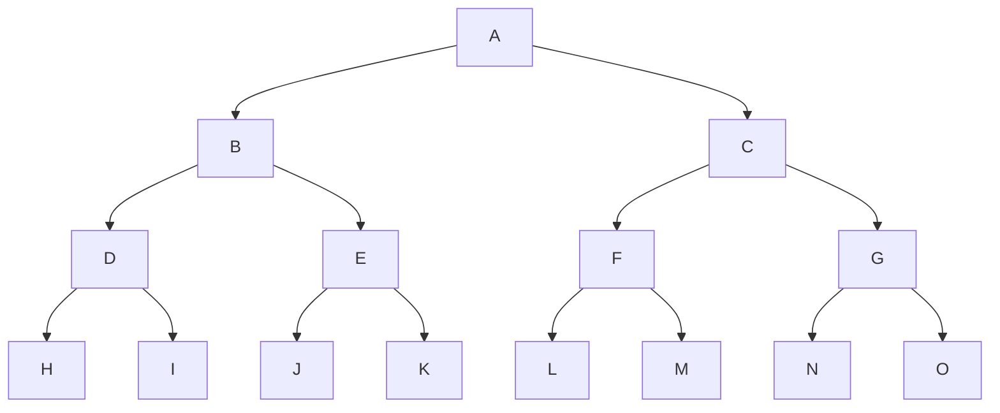

#GLO-2100 

Ceci est un arbre graphique

```mermaid
flowchart TD;
    A --> B
    A --> C
    B --> D
    B --> E
    C --> F
    C --> G
    D --> H
    D --> I
    E --> J
    E --> K
    F --> L
    F --> M
    G --> N
    G --> O
```

### Propriété
---
- 1 seul source
- Plusieurs puits (feuilles)
- Degré d'entré de tous les nœud est 1
- Un chemin existe de la racine à tous les nœud
