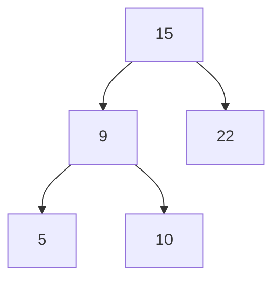

#school/GLO-2100 
***
# Avant le cour
## Plan de cours
- 

## Todo
- 

---
# Matière abordée

- Parcours d'arbre

## Notes supplémentaire
#### Pré-ordre
==Nœud== $\to$ ==S.A. Gauche== $\to$ ==S.A. Droite==

#### En-ordre (symétrique)
==S.A. Gauche== $\to$ ==Nœud== $\to$ ==S.A. Droite==

#### Post-ordre
==S.A. Gauche== $\to$ ==S.A. Droite== $\to$ ==Nœud==

#### Utilisation
Construit / Copy $\to$ Pre-ordre
Détruire $\to$ Post-ordre
Affichage $\to$ En-ordre

1 elm / node vs 1 bucket : Contienent plusieur item par noeud
    Placement d'array dans des arbre

$S = [5, 9, 10, 15, 22] \qquad P = [15, 9, 5, 10, 22]$

#### Construire par parcours
0. Condition d'arrêt : Frapper un null_ptr
    1. Trouver la racine (ajouter dans l'ordre)
        1er élément de pré-ordre
    2. Racine $\to$ Gauche = Construire-par-parcours
        $S =$ Gauche du 1er elem., $P =$ p sauf 1er elm
    3. Racine $\to$ Droite = Construire-par-parcours
        $S =$ Droite du 1er elem., $P =$ p sauf 1er elm

---
# En retrospective