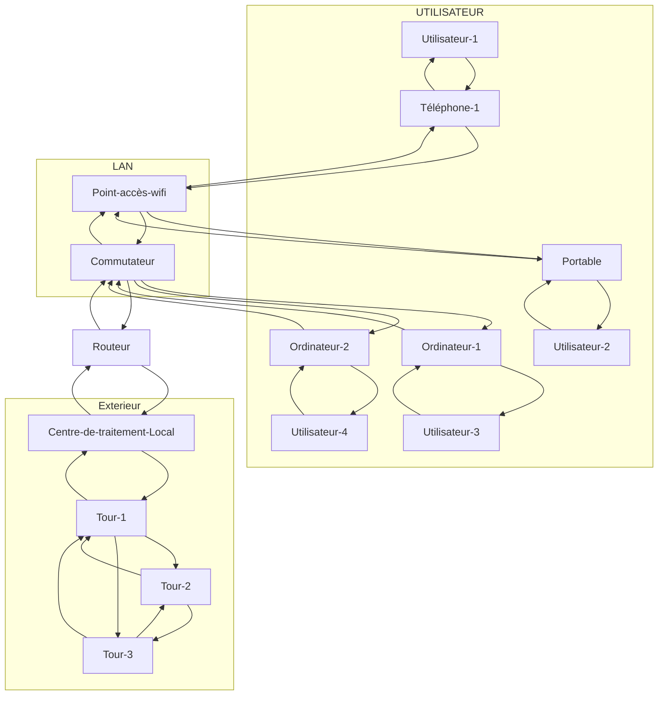

#school/GLO-2100 
# Réseau IP

### Graph utilisé
---
![[Tp2-Enoncer.pdf#page=2&rect=156,263,454,431|Tp2-Enoncer, p.2]]

> [!Attention] Avertissements 
> Il est interdit de modifier le modèle d’implantation de la classe Reseau, Graphe ou Routeur, cependant, vous avez le droit d’ajouter : 
> 1. des méthodes privées aux trois classes afin d’optimiser votre implantation, c’est même très encouragé
> 2. des définitions de constantes
> 3. d’inclusion d’autres classes de la librairie STL que ceux déjà inclus dans Reseau.h si vous sentez la nécessité.
> ([[Tp2-Enoncer.pdf#page=2&selection=87,0,123,13&color=yellow|Tp2-Enoncer, p.2]])

## Ce qui est demander
---
### Completion de la classe Graphe
- [x] La méthode `estFortementConnexe`
    - [x] Retour [[Tp2-Enoncer.pdf#page=4&selection=44,0,44,41&color=yellow|p.4]]
- [x] La méthode `dijkstra`
    - [x] Précondition [[Tp2-Enoncer.pdf#page=4&selection=72,0,74,23&color=yellow|p.4]]
    - [x] Postcondition [[Tp2-Enoncer.pdf#page=4&selection=78,0,80,22&color=yellow|p.4]]
    - [x] Retour [[Tp2-Enoncer.pdf#page=4&selection=118,0,120,6&color=yellow|p.4]]
- [x] La méthode `getPointsArticulation`
    - [x] Retour [[Tp2-Enoncer.pdf#page=4&selection=151,0,152,25&color=yellow|p.4]]

### Completion de la classe Reseau

> [!Important] Important. 
> Nous vous fournissons quelques méthodes du type Reseau, entre autres : `afficherRouteurs()`, pour vous en servir lors des tests, ainsi qu’un constructeur qui prend en argument un fichier en entrée et qui construit le réseau décrit dans ce fichier dans un graphe en mémoire. Leur déclaration ainsi que leur implémentation se trouve dans les fichiers Reseau.h et Reseau.cpp respectivement. ([[Tp2-Enoncer.pdf#page=5&selection=46,0,96,15&color=note|Tp2-Enoncer, p.5]])

- [x] Faire le fichier `ReseauTesteur.cpp`
    Vous devez créer le fichier ReseauTesteur.cpp. Ce testeur contiendra vos google tests. ([[Tp2-Enoncer.pdf#page=5&selection=100,0,108,17&color=yellow|p.5]])
    - [x] Test de la méthode `determinerMinParcours`
    - [x] Test de la méthode `routeursAccessibles`
    - [x] Test de la méthode `routeurCritiques`
- [x] La méthode `determinerMinParcours`
    - [x] Précondition [[Tp2-Enoncer.pdf#page=5&selection=149,0,149,34&color=yellow|p.5]]
    - [x] Postcondition [[Tp2-Enoncer.pdf#page=5&selection=153,0,160,47&color=yellow|p.5]]
    - [x] Retour [[Tp2-Enoncer.pdf#page=5&selection=196,0,196,32&color=yellow|p.5]]
- [x] La méthode `routeursAccessibles`
    - [x] Précondition [[Tp2-Enoncer.pdf#page=6&selection=47,0,51,12&color=yellow|p.6]]
    - [x] Retour [[Tp2-Enoncer.pdf#page=6&selection=55,0,55,89&color=yellow|p.6]]
- [x] La méthode `routeurCritiques`
    - [x] Précondition [[Tp2-Enoncer.pdf#page=6&selection=109,0,111,8&color=yellow|p.6]]
    - [x] Postcondition [[Tp2-Enoncer.pdf#page=6&selection=115,0,119,23&color=yellow|p.6]]
    - [x] Retour [[Tp2-Enoncer.pdf#page=6&selection=132,0,136,46&color=yellow|p.6]]

### Investigation
Vous devez investiguer d’autres méthodes de plus court chemin qui s’applique à tous types de graphes. Vous devez présenter 3 autres algorithmes de plus court chemin dont au moins un qui n’a pas été vu en classe.
([[Tp2-Enoncer.pdf#page=6&selection=142,0,147,7&color=yellow|Tp2-Enoncer, p.6]])

- [ ] Évaluer les caractéristique du réseau
- [ ] Définition de la question à étudier :
    La formulation, en vos propres mots, de ce que vous devez faire pour cette investigation
- [ ] Démarche d’investigation 
    Un résumé sur les algorithmes de plus court chemin que vous avez envisagés et les raisons qui ont conduit au choix de votre algorithme dans le cadre du routage dans Internet. 
- [ ] Application de la démarche d’investigation : 
    Vous devez décrire ces algorithmes (fonctionnement, analyse algorithmique). Vous devez également donner des avantages et inconvénients pour chacun d’eux ainsi que des cas d’utilisation.
- [ ] Analyse des données recueillies :
    Une présentation des résultats obtenus suite à votre démarche d’investigation et votre analyse de ces résultats.
- [ ] Conclusion : Vos conclusions et recommandations.
([[Tp2-Enoncer.pdf#page=7&selection=22,0,80,35&color=yellow|Tp2-Enoncer, p.7]])

## Fichier à fournir
---
- [x] Le fichier `Routeur.h` contenant la description interne du type `Routeur` 
- [x] Le fichier `Routeur.cpp`
- [x] Le fichier `Reseau.txt` contenant les données d’un réseau IP. 
- [x] `Reseau.h` contenant la description interne du type `Reseau`. 
- [x] `Reseau.ccp` à compléter. 
- [x] `Graphe.h` contenant la description interne du type graphe. 
- [x] `Graphe.hpp` à compléter 
- [x] `ContratException.h` et `ContratException.cpp` pour l’implémentation du contrat. 
- [x] Un fichier `main.cpp` pour exécuter votre code.
([[Tp2-Enoncer.pdf#page=7&selection=87,0,125,45&color=note|Tp2-Enoncer, p.7]])

