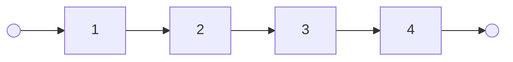
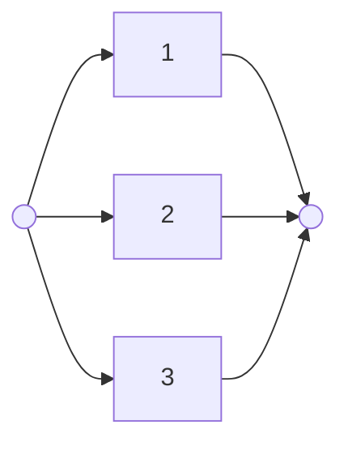
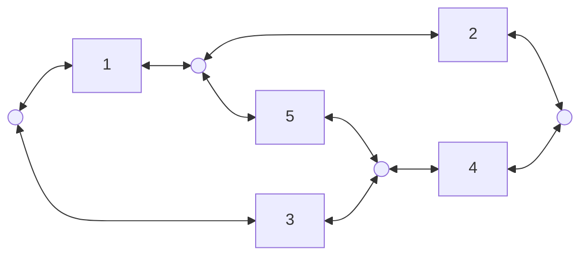
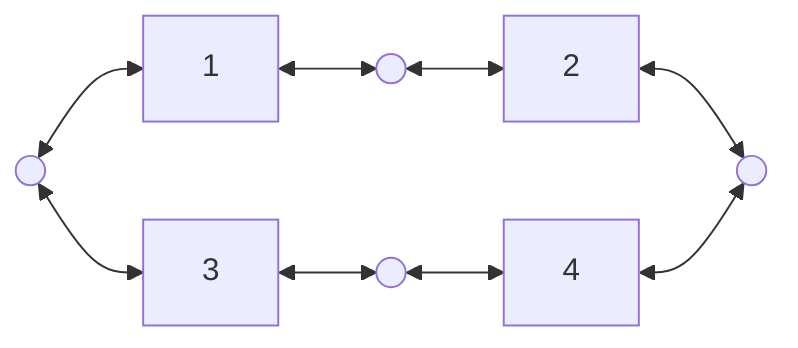
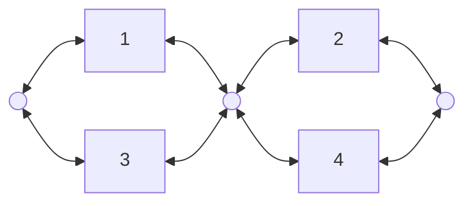

#STT-2920 

La fiabilité des réseau est une représentation en [[Graph|graph]] d'un [[Circuit électrique|circuit]] ayant des [[Composante électrique|composante]] qui fonctionne avec une probabilité donnée.

### Modèle mathématique
---
#### Composante en série
Dans le cas en série il est important que tous les composante du réseau fonctionne pour que celui-ci fonctionne.

Donc:
$$\mathbb{P}[A] = \mathbb{P}[E_{1} \cap E_{2} \cap E_{3} \cap E_{4}] = \mathbb{P}[E_{1}]  \mathbb{P}[E_{2}]  \mathbb{P}[E_{3}]  \mathbb{P}[E_{4}] = p_{1}p_{2}p_{3}p_{4}$$

#### Composante en parallèle
Dans le cas en parallèle il est important que aux moins une composante du réseau fonctionne pour que celui-ci fonctionne.

Donc:
$$\mathbb{P}[A] = \mathbb{P}[E_{1} \cup E_{2} \cup E_{3}] = 1 - \mathbb{P}[(E_{1} \cup E_{2} \cup E_{3})^{C}] = 1 - \mathbb{P}[E_{1}^{C} \cap E_{2}^{C} \cap E_{3}^{C}]$$
$$1 - \mathbb{P}[E_{1}^{C} \cap E_{2}^{C} \cap E_{3}^{C}] = 1-(1- p_{1})(1 - p_{2})(1-p_{3})$$

#### réseau sous-grouper
---
Pour simplifier certain réseau il est possible d'effectuer des formule de réseau sur des ensemble de composante

#### Conditionnement sur une composante
---
Dans certain cas il est possible que le réseau peuvent avoirs différent état selon une ou plusieurs composante

Basé sur le fonctionnement de 5 les deux sous-réseau suivant sont valide:

Dans ce cas la probabilité de chacun des réseau est pondéré par la probabilité que la composante 5 fonctionne,