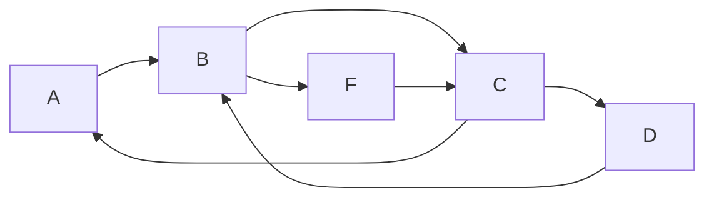
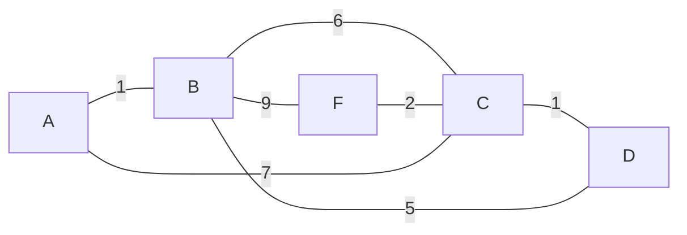

#GLO-2100 

Les graph est la représentation de valeurs connecter et lien afin d'exprimer des état ou valeurs a un problème

### Atributs
---
**Boucle**: Chemin d'un élément à lui-même
**Cycle**: Chemin qui permet de tourner en rond
**Acyclique**: Graph qui n'a pas de cycle
**Connexe**: Toujours un chemin possible entre deux point du graph
    **Faiblement connexe** : En graph orienté si tous est connexe sans les orientation
    **Fortement connexe**: En graph orienté si tous est connexe avec les orientation (Ex: [[Arbre graphique|Arbre]])
**Puits**: Point d'ont il a aucune sortie
**Source**: Point d'ont il a aucune entré

### Types
---
##### graph-orienté
un graph orienté est un graph dont ces arrête on un sens et direction (sommet et arc).

##### graph non-orienté
Un graph non orienté n'a pas de direction pour ces arrête:

##### graph pondéré
Un graph pondéré peut être orienté ou non. Un graph pondéré aura des valeurs sur ces arrête ou arc.

### Représentation mathématique / informatique
---
##### Matrice d'ajacence
La matrice d'ajacence permet de décrire les arc entre les sommets
$$M[i][j] = 1 \text{ si de } i \to j \text{ est une arrète}$$

>[!Success] Avantage
> - Temps $O(1)$ pour savoir si l'arc existe

>[!Fail] Désavantage
>- Temps $O(n)$ pour connaitre les voisin
>- Prend une espace mémoire en $O(n^2)$

##### Liste d'ajacence
La liste d'ajacence attribut une liste de voisin a chaque sommet:
$$
\begin{array}{ccccc}
\text{sommet}&\to&\text{sommet,}& \text{sommet,}& \text{sommet}\\
1&\to&2,&4&\\
2&\to&1&&\\
3&\to&2,&4&\\
4&\to&1,&2, &3\\
\end{array}
$$

>[!Success] Avantage
> - Mémoire en $O(n + m)$

>[!Fail] Désavantage
> - Accès à l'arc est difficile